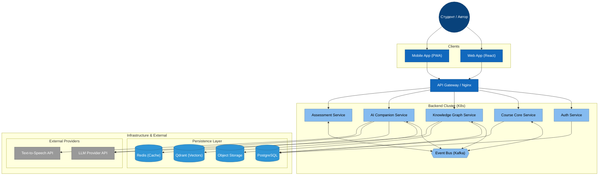

### 1.1 Основные сценарии

Cистема поддерживает три режима:
1.  **Lecture-Free:** Самостоятельное изучение. Система генерирует лонгриды или аудио-лекции на основе загруженных материалов.
2.  **Кейс-тренажер:** Практическая отработка навыков через диалоговые симуляции с автоматической оценкой.
3.  **AI-помощник:** Сквозной ассистент для навигации, ответов на вопросы (RAG) и объяснения сложных терминов.

---

## 2. Высокоуровневая Архитектура

Система строится на базе микросервисной архитектуры для обеспечения масштабируемости ресурсоемких AI-задач.

### 2.1 C4 Container Diagram



---

## 3. Описание Микросервисов

### 3.1 Auth Service
*   **Функции:** Регистрация, авторизация (JWT), управление ролями (Автор/Студент).
*   **Специфика:** Содержит модуль онбординга для определения профиля студента (тест на стиль обучения Колба, сбор интересов).

### 3.2 Course Core Service
*   **Функции:** Управление метаданными курсов, CRUD операции, настройки доступа, версионирование.
*   **Данные:** Хранит структуру «Курс -> Модули».

### 3.3 Knowledge Graph Service (Генератор структуры)
*   **Функции:**
    *   Автоматическое построение графа знаний из документов.
    *   Редактирование узлов и связей (API для визуального редактора).
    *   Валидация целостности графа.
*   **Технологии:** NetworkX (для логики графа), LangChain (для экстракции).

### 3.4 AI Companion Service (Основной "мозг")
*   **Функции:**
    *   **Ingestion:** Парсинг файлов, чанкинг, векторизация.
    *   **Generation:** Создание персонализированных лонгридов/лекций "на лету".
    *   **Chat:** RAG-пайплайн для ответов на вопросы с контекстом истории.
*   **Технологии:** LangChain, OpenAI GPT-4o, Qdrant.

### 3.5 Assessment Service
*   **Функции:**
    *   Генерация тестов (Single/Multi choice) по материалам.
    *   **Case Engine:** Запуск интерактивных кейсов (State Machine), где AI оценивает ответы студента по критериям.
*   **Технологии:** LangGraph (для управления состоянием диалога в кейсе).

---

## 4. Детальная Архитектура AI (The AI Core)

Эта подсистема отвечает за интеллектуальную обработку контента.

### 4.1 Ingestion Pipeline (Загрузка материалов)
Асинхронный процесс обработки загруженных PDF/DOCX.

1.  **Parsing:** `Unstructured` или `LlamaParse` извлекают текст, таблицы и структуру.
2.  **Chunking:** Семантическая разбивка текста (500-1000 токенов с перекрытием 10%).
3.  **Embedding:** Генерация векторов (`text-embedding-3-small`) и сохранение в Qdrant.

### 4.2 Graph Generation Logic
1.  **Extraction:** LLM проходит по тексту и извлекает ключевые концепты (Concepts).
2.  **Clustering:** Группировка концептов в Темы/Разделы.
3.  **Linking:** LLM определяет зависимости (Prerequisites) между темами.
4.  **Output:** JSON-структура для сохранения в PostgreSQL и отображения в React Flow.

### 4.3 Personalization Engine (RAG + Style Transfer)
Генерация контента для режима **Lecture-Free**:

*   **Input:** ID узла графа + Профиль студента (напр. "Деятель/Activst", Интерес: "Кино").
*   **Retrieval:** Поиск релевантных чанков в Qdrant.
*   **Synthesis Prompt:**
    > "Ты преподаватель. Объясни тему {topic} на основе контекста {context}.
    > Стиль обучения: Через практику и эксперименты.
    > Используй метафоры из сферы: Кинопроизводство.
    > Тон: Дружелюбный."
*   **Output:** Markdown-текст или SSML для TTS.

### 4.4 Case Simulator (Оценка навыков)
Реализован как граф состояний (LangGraph):
*   **Node: Bot:** Выдает вводную кейса.
*   **Node: User:** Получает ответ студента.
*   **Node: Evaluator (LLM):** Скрытый шаг. Проверяет ответ по Rubrics (критериям).
    *   *If OK:* Переход к следующему шагу сюжета.
    *   *If Fail:* Генерация наводящего вопроса (Hint).

---

## 5. Модель Данных (Схема БД)

### 5.1 PostgreSQL (Основные сущности)

```sql
-- Курсы
CREATE TABLE courses (
    id UUID PRIMARY KEY DEFAULT gen_random_uuid(),
    author_id UUID NOT NULL,
    title VARCHAR(255),
    scenario_type VARCHAR(50), -- 'lecture_free', 'case_trainer'
    status VARCHAR(20) DEFAULT 'draft'
);

-- Граф знаний (Узлы)
CREATE TABLE graph_nodes (
    id UUID PRIMARY KEY DEFAULT gen_random_uuid(),
    course_id UUID REFERENCES courses(id),
    title VARCHAR(255),
    summary TEXT,
    content_refs JSONB, -- Ссылки на чанки в VectorDB
    position_data JSONB, -- Координаты X/Y для React Flow
    parent_node_id UUID -- Иерархия
);

-- Профиль студента
CREATE TABLE student_profiles (
    user_id UUID PRIMARY KEY,
    kolb_type VARCHAR(50), -- 'diverging', 'assimilating', etc.
    interests TEXT[], -- ['football', 'programming']
    communication_style VARCHAR(50)
);

-- Прогресс
CREATE TABLE student_progress (
    user_id UUID,
    node_id UUID,
    status VARCHAR(20), -- 'locked', 'available', 'completed'
    score FLOAT,
    last_interaction TIMESTAMP
);
```

### 5.2 Qdrant (Векторные коллекции)

*   **Collection:** `course_materials`
*   **Payload:**
    *   `course_id`: UUID
    *   `node_id`: UUID (привязка к графу)
    *   `text_content`: Original text
    *   `file_source`: Filename

---

## 6. Технологический Стек

### Backend & AI
| Компонент | Технология | Комментарий |
| :--- | :--- | :--- |
| **Language** | **Python 3.11+** | Основной язык backend. |
| **Framework** | **FastAPI** | Высокопроизводительный Async API. |
| **Task Queue** | **Celery + Redis** | Для долгих задач (парсинг, генерация). |
| **LLM Orchestration** | **LangChain / LangGraph** | Управление цепочками RAG и агентами. |
| **LLM Provider** | **OpenAI API** | GPT-4o (Logic), GPT-4o-mini (Chat). |
| **Vector DB** | **Qdrant** | Поиск по смыслу. |

### Frontend
| Компонент | Технология | Комментарий |
| :--- | :--- | :--- |
| **Framework** | **React 18** | SPA архитектура. |
| **Language** | **TypeScript** | Строгая типизация. |
| **State Manager** | **Zustand + React Query** | Локальный стейт и кэш сервера. |
| **Graph UI** | **React Flow** | Визуализация и редактор графа знаний. |
| **Streaming** | **Server-Sent Events (SSE)** | Эффект "печатания" текста в чате. |

### Infrastructure
| Компонент | Технология | Комментарий |
| :--- | :--- | :--- |
| **Containerization** | **Docker** | Упаковка сервисов. |
| **Orchestration** | **Kubernetes (K8s)** | Управление контейнерами. |
| **CI/CD** | **GitLab CI / GitHub Actions** | Автоматический деплой. |
| **Storage** | **S3 Compatible (MinIO)** | Файловое хранилище. |

---

## 7. API Контракты (Примеры)

### 7.1 Chat Endpoint (Streaming)

**Request:** `POST /api/v1/chat/completions`
```json
{
  "course_id": "550e8400-e29b...",
  "context_node_id": "770e8400-e29b...",
  "messages": [
    {"role": "user", "content": "Объясни этот термин проще"}
  ]
}
```
**Response:** `text/event-stream` (поток токенов).

### 7.2 Graph Generation Endpoint

**Request:** `POST /api/v1/courses/{id}/graph/generate`
```json
{
  "files": ["s3_key_1.pdf", "s3_key_2.docx"],
  "depth": "deep"
}
```
**Response:** `202 Accepted` (Task ID).

---

## 8. Нефункциональные требования (NFR)

1.  **Latency:** Начало ответа в чате (TTFT) < 1.5 сек.
2.  **Scalability:** Поддержка одновременной работы до 2000 активных студентов.
3.  **Reliability:** Изоляция контекста (студент A не видит данные курса студента B в RAG).
4.  **Observability:** Логирование всех LLM-запросов (input/output/cost) для аналитики затрат.

---

## 9. План разработки (Roadmap)

1.  **Phase 1 (MVP Core):**
    *   Авторизация.
    *   Загрузка файлов + Генерация простого графа.
    *   Базовый RAG-чат по документам.
2.  **Phase 2 (Educational Logic):**
    *   Реализация онбординга (тест Колба).
    *   Генерация персонализированных лонгридов (Lecture-Free).
    *   Интеграция React Flow для редактирования графа.
3.  **Phase 3 (Advanced):**
    *   Кейс-тренажер (Assessment Service).
    *   Аналитика преподавателя.
    *   Мобильная адаптация.